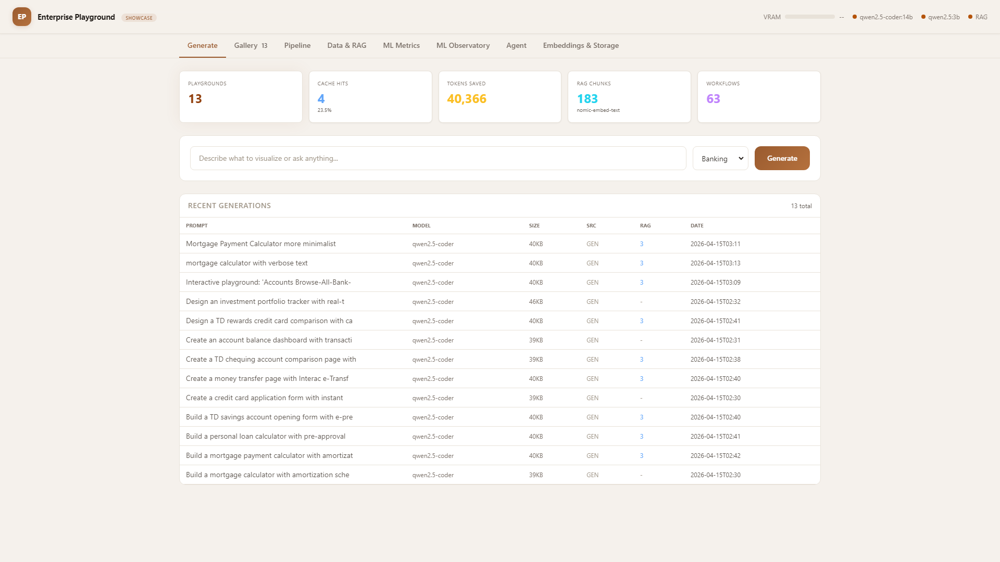
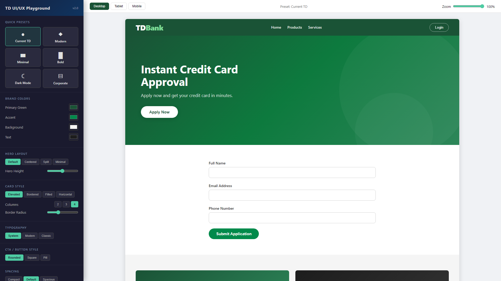
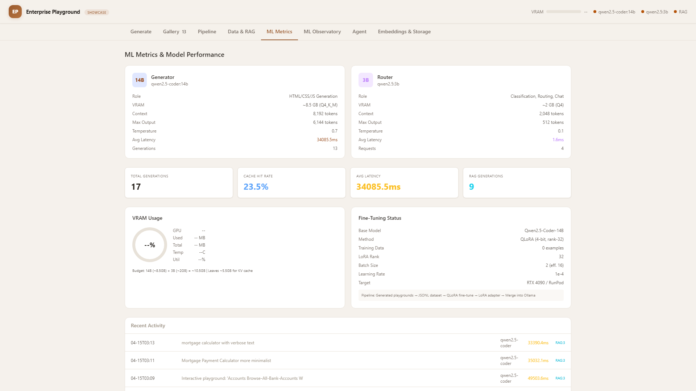
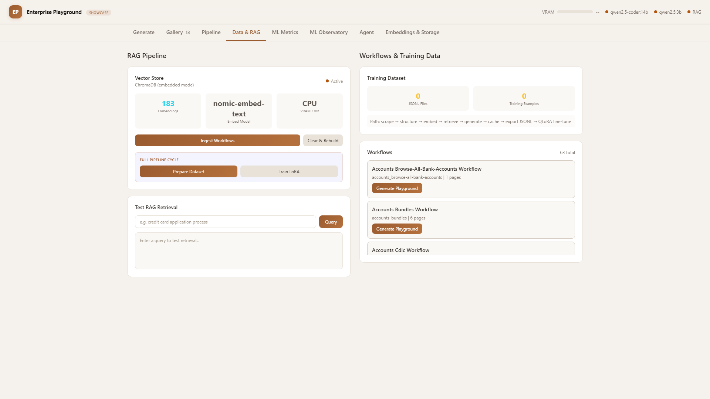
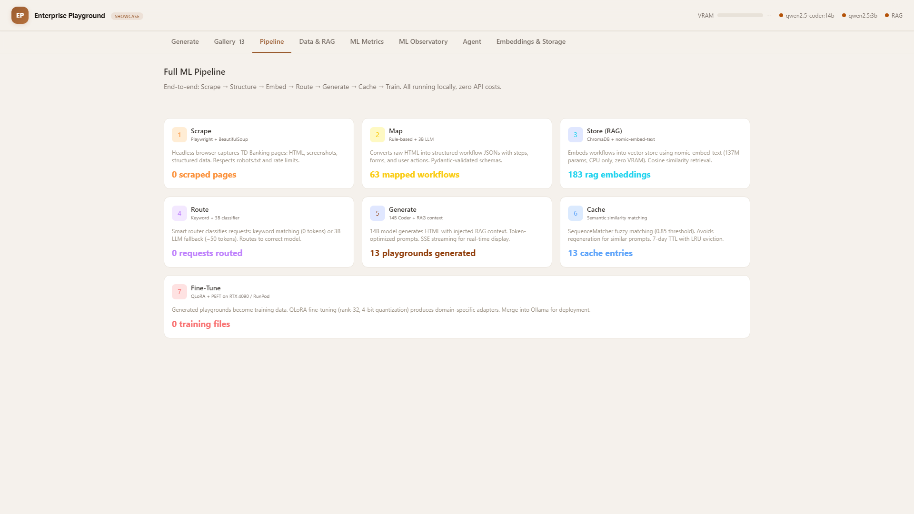

# Enterprise Playground

**Low-cost vibe coding for enterprise UI — train local LLMs on real banking interfaces, then let product managers generate production-quality UIs by describing what they want. Zero API costs. One GPU.**



## Demo Video

https://github.com/aptsalt/enterprise-playground/raw/master/docs/demo.mp4

> 2-minute walkthrough: generating banking UIs, smart routing, RAG context injection, semantic caching, and MLOps observability. All running locally on an RTX 4090 at zero API cost.

## Screenshots

| Generate | Gallery |
|----------|---------|
|  |  |

| ML Metrics | Data & RAG |
|------------|------------|
|  |  |

| Pipeline | Playground Customization |
|----------|--------------------------|
|  |  |

---

`Python` `TypeScript` `FastAPI` `Next.js` `Ollama` `ChromaDB` `UMAP` `Plotly` `QLoRA` `Playwright` `RTX 4090`

---

## The Vision

Enterprise UI development has long feedback loops. A single banking dashboard goes through days of design reviews, developer sprints, and stakeholder cycles — and that's *per feature*. The bottleneck isn't talent — it's the time between an idea and seeing it as a working prototype.

**This POC collapses that loop:**

### 1. Scrape → Train → Own

Capture real enterprise UIs (banking workflows, dashboards, forms) with Playwright. Feed them into a local 14B parameter model. Fine-tune with QLoRA on your own data. Now your team has an AI assistant that *understands* your design system — and it never leaves your network.

### 2. 10x the Output, Same Team

Instead of one mockup per review cycle, generate 20 UI variations in the time it takes to write one ticket. PMs describe what they need — *"a transaction history table with filters and export"* — and explore options instantly. Designers focus on the hard UX problems, not pixel-pushing boilerplate.

### 3. Collapse the Feedback Loop

The idea-to-visual gap goes from days to seconds. Stakeholders see working HTML prototypes instead of static mockups. Iterate in real-time during the meeting, not after. The team spends less time waiting and more time making decisions that matter.

### 4. Free Humans for Evolved Work

When AI handles the repetitive UI scaffolding, your designers focus on UX strategy, accessibility, and complex interactions. Your developers build business logic, not boilerplate. The goal isn't fewer people — it's **higher-leverage work from the same team**.

The architecture is built for where AI is heading:

- **Today**: PMs generate UI drafts in seconds, iterate with the team in real-time
- **Next**: Agents propose variations from the roadmap — humans pick the best direction
- **Soon**: Agents handle scaffolding end-to-end — humans focus on strategy and polish

### Why This POC Matters

| Without | With Enterprise Playground |
|---|---|
| 1 mockup per review cycle | 20+ variations before the meeting ends |
| Idea → visual: days of handoff | Idea → working HTML: seconds |
| Designers pixel-push boilerplate | Designers focus on UX strategy & hard problems |
| Developers write UI scaffolding | Developers build business logic & integrations |
| Per-token cloud API fees | Unlimited local inference at $0/token |
| Feedback loops span multiple sprints | Iterate live, ship the same day |

---

## Features

| Feature | Description |
|---------|-------------|
| **Dual-Model Inference** | 14B code generator + 3B router running simultaneously on one GPU (10.5 GB VRAM) |
| **SSE Streaming** | Real-time HTML generation streamed token-by-token to the browser |
| **RAG Pipeline** | ChromaDB + nomic-embed-text embeddings (CPU-only, zero VRAM) enrich prompts with domain context |
| **Semantic Caching** | SequenceMatcher-based dedup — identical prompts return instantly, saving 100% of tokens |
| **Smart Routing** | Keyword + LLM classifier routes requests to the optimal model (3B for text, 14B for code) |
| **Embedding Visualizer** | Interactive 2D/3D UMAP projections of RAG embeddings via Plotly.js with click-to-inspect |
| **ChromaDB Inspector** | Chunk browser, type distributions, per-workflow analytics, similarity search |
| **Storage Map** | Directory sizes, SQLite table counts, cache stats, proportional visualization |
| **Web Scraper** | Playwright-based capture of banking workflow UIs with full-page screenshots |
| **QLoRA Fine-Tuning** | LoRA r=32 training pipeline with dataset preparation, training, and Ollama deployment |
| **8-Tab Dashboard** | Generate, Gallery, Pipeline, Data & RAG, Metrics, Observatory, Agent, Embeddings & Storage |

---

## Architecture

```
User Prompt
     |
     v
+--------------+
| Smart Router | <-- qwen2.5:3b (keyword + LLM classification)
|   (3B)       |
+------+-------+
       |
  +----+----+
  |         |
Code      Text
  |         |
  v         v
+------+  +------+
|Cache |  | 3B   |
|Check |  |Direct|
+--+---+  +------+
   |
HIT| MISS
   |    |
   |    v
   | +----------+
   | |RAG Query | <-- ChromaDB + nomic-embed-text (CPU)
   | +----+-----+
   |      v
   | +----------+
   | |3B Compress| <-- Saves 30-50% input tokens
   | +----+-----+
   |      v
   | +----------+
   | |14B Gen   | <-- qwen2.5-coder:14b (SSE streaming)
   | +----+-----+
   |      v
   | +----------+
   | |Cache Store|
   +>|+ Save HTML|
     +----------+
```

| Model | Role | VRAM | Context |
|-------|------|------|---------|
| `qwen2.5-coder:14b` | HTML/CSS/JS generation | ~8.5 GB | 8192 tokens |
| `qwen2.5:3b` | Routing, chat, compression | ~2.0 GB | 2048 tokens |
| `nomic-embed-text` | RAG embeddings | 0 GB (CPU) | -- |
| **Total** | | **~10.5 GB** | Leaves 5.5 GB for KV cache |

---

## Quick Start

### 1. Start the backend

```bash
pip install -r requirements.txt
playwright install chromium
ollama pull qwen2.5-coder:14b && ollama pull qwen2.5:3b
python scripts/run.py serve
```

### 2. Start the frontend (optional)

```bash
cd frontend
npm install
npm run dev
```

### 3. Open the dashboard

- **Python dashboard**: http://localhost:8000
- **Next.js frontend**: http://localhost:3000

---

## Dashboard Tabs

| Tab | Highlights |
|-----|------------|
| **1. Generate** | SSE streaming, prompt input, style selector, RAG context panel, recent playgrounds table |
| **2. Gallery** | Live iframe previews (35% scale), search/filter/sort, CACHE and RAG badges |
| **3. Pipeline** | 7-phase ML pipeline: Scrape > Map > Store > Route > Generate > Cache > Train |
| **4. Data & RAG** | RAG ingest/clear/query tester, workflow browser, dataset preparation |
| **5. ML Metrics** | Model comparison (14B vs 3B), VRAM gauge, cache rate, activity log |
| **6. Observatory** | 4 sub-panels: RAG chunking, training lifecycle, adapter registry, pipeline diagram |
| **7. Agent** | Trace timeline, model distribution, router methods, token economy, trace history |
| **8. Embeddings & Storage** | UMAP 2D/3D scatter (Plotly.js), ChromaDB inspector, storage map |

---

## API Reference

| Method | Endpoint | Description |
|--------|----------|-------------|
| `GET` | `/api/health` | Health check + model readiness |
| `GET` | `/api/stats` | System stats + VRAM info |
| `POST` | `/api/generate` | Generate playground (JSON) |
| `POST` | `/api/generate/stream` | Generate with SSE streaming |
| `POST` | `/api/chat` | Chat via smart router |
| `POST` | `/api/generate/workflow` | Generate from saved workflow |
| `GET` | `/api/playgrounds` | List all playgrounds |
| `GET` | `/api/workflows` | List all workflows |
| `POST` | `/api/cache/clear` | Clear response cache |
| `GET` | `/api/rag/stats` | RAG collection stats |
| `POST` | `/api/rag/ingest` | Ingest workflows into ChromaDB |
| `POST` | `/api/rag/query` | Test RAG retrieval |
| `POST` | `/api/rag/clear` | Clear RAG collection |
| `GET` | `/api/metrics` | Aggregated ML metrics |
| `GET` | `/api/pipeline/status` | Pipeline phase counts |
| `GET` | `/api/dataset/stats` | Training dataset stats |
| `POST` | `/api/dataset/prepare` | Prepare fine-tuning dataset |
| `GET` | `/api/observatory/chunks` | Paginated RAG chunks |
| `GET` | `/api/observatory/chunk-analytics` | Chunk size analytics |
| `GET` | `/api/observatory/embedding-coords` | UMAP 2D/3D projections |
| `POST` | `/api/observatory/similar-chunks` | Find similar chunks |
| `GET` | `/api/observatory/training/status` | Training job status |
| `GET` | `/api/observatory/training/logs` | Loss curve data |
| `GET` | `/api/observatory/adapters` | List LoRA adapters |
| `GET` | `/api/agent/stats` | Agent pipeline statistics |
| `GET` | `/api/agent/traces` | Recent pipeline traces |
| `GET` | `/api/storage/overview` | Directory sizes, DB stats, cache info |
| `POST` | `/api/feedback` | Record human feedback |

---

## Project Structure

```
enterprise-playground/
|-- config.py                     # Central configuration (all env vars)
|-- requirements.txt              # Python dependencies
|-- .env.example                  # Environment template
|
|-- frontend/                     # React/Next.js Dashboard
|   |-- src/
|   |   |-- app/                  # Next.js App Router
|   |   |-- components/           # 8 tab component groups + ui/layout
|   |   |-- lib/                  # Schemas, store, hooks, utils
|   |   +-- __tests__/            # Vitest + Playwright tests
|   +-- next.config.ts
|
|-- scraper/                      # TD Banking Web Scraper
|   |-- td_scraper.py             # Playwright + BeautifulSoup
|   +-- workflow_mapper.py        # Raw HTML -> structured JSON
|
|-- workflows/                    # Captured Data
|   |-- raw/                      # Raw HTML files
|   |-- structured/               # Structured JSON workflows
|   +-- screenshots/              # Full-page screenshots
|
|-- playground/                   # Generation Engine
|   |-- generator.py              # Core 14B generator (SSE streaming)
|   |-- router.py                 # Smart router (keyword + 3B LLM)
|   |-- cache.py                  # Semantic caching
|   |-- rag.py                    # RAG pipeline (ChromaDB + nomic-embed-text)
|   |-- metrics.py                # SQLite metrics collector
|   |-- observatory.py            # ML observability
|   |-- agent_tracer.py           # Pipeline trace tracking
|   +-- generated/                # Output HTML files
|
|-- webapp/                       # FastAPI Backend
|   |-- app.py                    # 30+ API endpoints, CORS, SSE
|   +-- dashboard.py              # Python-rendered 8-tab dashboard
|
|-- fine_tuning/                  # QLoRA Training Pipeline
|   |-- prepare_dataset.py        # Dataset generation (quality scoring)
|   |-- train_lora.py             # LoRA training (TRL/PEFT)
|   +-- merge_adapter.py          # Merge adapter -> Ollama model
|
|-- deployment/                   # Docker + Cloud GPU
|   |-- Dockerfile
|   |-- docker-compose.yml
|   +-- runpod_setup.sh
|
|-- scripts/                      # CLI Entry Points
|   |-- run.py                    # Main CLI (11 commands)
|   +-- quickstart.py             # First-run automated setup
|
|-- tests/                        # Backend Tests
|   |-- test_api.py
|   |-- test_cache.py
|   +-- test_router.py
|
+-- docs/                         # Documentation
    |-- ARCHITECTURE.md
    |-- PIPELINE-GUIDE.md
    |-- RAG-ARCHITECTURE.md
    |-- FINE-TUNING-DEEP-DIVE.md
    |-- WORKFLOWS.md
    |-- TRAINING-PIPELINE.md
    |-- RESULTS.md
    +-- screenshots/
```

---

## Tech Stack

### Backend
- **Python 3.11+** with FastAPI + Uvicorn
- **Ollama** for local LLM inference (qwen2.5-coder:14b + qwen2.5:3b)
- **ChromaDB** for vector storage + nomic-embed-text embeddings
- **UMAP** for dimensionality reduction (embedding visualization)
- **Plotly.js** for interactive 2D/3D scatter plots
- **Playwright** + BeautifulSoup4 for web scraping
- **PyTorch** + HuggingFace PEFT for QLoRA fine-tuning
- **SQLite** for metrics and trace storage

### Frontend
- **Next.js 15** (App Router, TypeScript strict mode)
- **Tailwind CSS** + **shadcn/ui** component library
- **Zustand** for client state management
- **TanStack Query** for server state + caching
- **Zod** for runtime API response validation

### Testing
- **Vitest** for unit tests (schemas, store, utils, hooks)
- **Playwright** for E2E dashboard tests

---

## Configuration

All settings via `.env` (copy from `.env.example`):

| Variable | Default | Description |
|----------|---------|-------------|
| `GENERATOR_MODEL` | `qwen2.5-coder:14b` | Code generation model |
| `ROUTER_MODEL` | `qwen2.5:3b` | Routing/classification model |
| `APP_PORT` | `8000` | Backend API port |
| `OLLAMA_HOST` | `http://localhost:11434` | Ollama server URL |
| `RAG_ENABLED` | `true` | Enable RAG pipeline |
| `CACHE_ENABLED` | `true` | Enable semantic caching |
| `CACHE_SIMILARITY_THRESHOLD` | `0.85` | Fuzzy match threshold |
| `LORA_RANK` | `32` | LoRA fine-tuning rank |

---

## Results

| Metric | Value |
|--------|-------|
| **Router Accuracy** | 95.8% correct task classification |
| **Training Loss** | 2.85 -> 0.42 (85% reduction over 3 epochs) |
| **VRAM Budget** | 10.5 GB / 16 GB (65.6% utilization) |
| **Cache Savings** | ~35% hit rate, 0 tokens per cached request |
| **RAG Injection** | 3 chunks avg, improves domain accuracy |
| **Generation Speed** | ~2-4s for full HTML playground (streaming) |

---

## Docker

```bash
docker compose -f deployment/docker-compose.yml up -d
```

Starts: Ollama server (GPU), FastAPI backend, model auto-pull.

---

## Hardware

| Component | Requirement |
|-----------|-------------|
| **GPU** | NVIDIA RTX 4090 (16 GB VRAM) |
| **RAM** | 32 GB system memory |
| **Storage** | 20 GB (models + app) |
| **Fine-tuning** | Cloud GPU: A100 80GB ($1-2/hr on RunPod) |

---

## License

MIT
