# Enterprise Playground — Technical Architecture

Deep-dive into the system design, data flows, optimization strategies, and component interactions.

> For step-by-step workflow documentation (every UI action mapped to code, DB, and data stores), see [WORKFLOWS.md](WORKFLOWS.md).

---

## Table of Contents

- [System Architecture](#system-architecture)
- [Dual-Model Design](#dual-model-design)
- [Request Routing Flow](#request-routing-flow)
- [Generation Pipeline](#generation-pipeline)
- [RAG Pipeline](#rag-pipeline)
- [Caching Layer](#caching-layer)
- [Metrics & Observability](#metrics--observability)
- [Scraping & Data Pipeline](#scraping--data-pipeline)
- [Fine-Tuning Pipeline](#fine-tuning-pipeline)
- [Web Application Architecture](#web-application-architecture)
- [VRAM Budget Analysis](#vram-budget-analysis)
- [Token Optimization Strategy](#token-optimization-strategy)
- [Data Models](#data-models)
- [Deployment Architecture](#deployment-architecture)
- [Security Considerations](#security-considerations)

---

## System Architecture

### High-Level Component Diagram

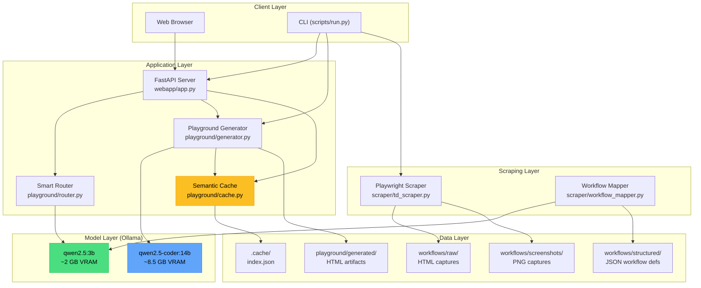
```mermaid
graph TB
    subgraph Client["Client Layer"]
        Browser["Web Browser"]
        CLI["CLI (scripts/run.py)"]
    end

    subgraph App["Application Layer"]
        FastAPI["FastAPI Server<br/>webapp/app.py"]
        Router["Smart Router<br/>playground/router.py"]
        Generator["Playground Generator<br/>playground/generator.py"]
        Cache["Semantic Cache<br/>playground/cache.py"]
    end

    subgraph Models["Model Layer (Ollama)"]
        Router3B["qwen2.5:3b<br/>~2 GB VRAM"]
        Generator14B["qwen2.5-coder:14b<br/>~8.5 GB VRAM"]
    end

    subgraph Data["Data Layer"]
        Workflows["workflows/structured/<br/>JSON workflow defs"]
        Generated["playground/generated/<br/>HTML artifacts"]
        CacheStore[".cache/<br/>index.json"]
        Raw["workflows/raw/<br/>HTML captures"]
        Screenshots["workflows/screenshots/<br/>PNG captures"]
    end

    subgraph Scraper["Scraping Layer"]
        TDScraper["Playwright Scraper<br/>scraper/td_scraper.py"]
        Mapper["Workflow Mapper<br/>scraper/workflow_mapper.py"]
    end

    Browser --> FastAPI
    CLI --> FastAPI
    CLI --> Generator
    CLI --> TDScraper

    FastAPI --> Router
    FastAPI --> Generator
    FastAPI --> Cache
    Router --> Router3B
    Generator --> Generator14B
    Generator --> Cache
    Mapper --> Router3B

    TDScraper --> Raw
    TDScraper --> Screenshots
    Mapper --> Workflows

    Generator --> Generated
    Cache --> CacheStore

    style Router3B fill:#4ade80,stroke:#22c55e,color:#000
    style Generator14B fill:#60a5fa,stroke:#3b82f6,color:#000
    style Cache fill:#fbbf24,stroke:#f59e0b,color:#000
```

### Component Responsibilities

| Component | File | Responsibility |
|-----------|------|----------------|
| **FastAPI Server** | `webapp/app.py` | HTTP routes, SSE streaming, dashboard rendering |
| **Smart Router** | `playground/router.py` | Request classification, model selection, context compression |
| **Generator** | `playground/generator.py` | HTML generation pipeline, streaming, metadata management |
| **Cache** | `playground/cache.py` | Semantic deduplication, LRU eviction, stats tracking |
| **Scraper** | `scraper/td_scraper.py` | Playwright-based page capture (HTML, screenshots, structure) |
| **Mapper** | `scraper/workflow_mapper.py` | Structured workflow creation from raw captures |
| **Schema** | `workflows/schema.py` | Pydantic type definitions for all data models |

---

## Dual-Model Design

### Why Two Models?

A single large model (32B+) wastes compute on simple tasks. Most user interactions are questions, summaries, or routing decisions — not code generation. The dual-model approach assigns each task to the minimum-capable model.

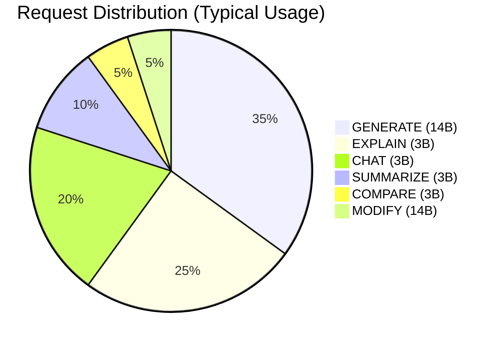
```mermaid
pie title Request Distribution (Typical Usage)
    "GENERATE (14B)" : 35
    "EXPLAIN (3B)" : 25
    "CHAT (3B)" : 20
    "SUMMARIZE (3B)" : 10
    "COMPARE (3B)" : 5
    "MODIFY (14B)" : 5
```

### VRAM Allocation

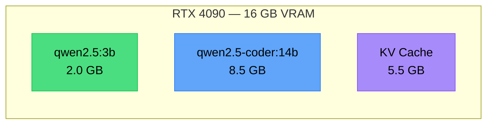
```mermaid
graph LR
    subgraph GPU["RTX 4090 — 16 GB VRAM"]
        direction TB
        A["qwen2.5:3b<br/>2.0 GB"]
        B["qwen2.5-coder:14b<br/>8.5 GB"]
        C["KV Cache<br/>5.5 GB"]
    end

    style A fill:#4ade80,stroke:#22c55e,color:#000
    style B fill:#60a5fa,stroke:#3b82f6,color:#000
    style C fill:#a78bfa,stroke:#8b5cf6,color:#000
```

| Resource | Allocation | Notes |
|----------|------------|-------|
| Router (3B Q4_K_M) | ~2.0 GB | Always loaded, handles 60-65% of requests |
| Generator (14B Q4_K_M) | ~8.5 GB | Loaded on demand by Ollama, handles code tasks |
| KV Cache | ~5.5 GB | Shared between both models |
| **Total** | **~16.0 GB** | Fits in RTX 4090 |

### Model Parameters

| Parameter | Generator (14B) | Router (3B) |
|-----------|----------------|-------------|
| Context window | 8192 tokens | 2048 tokens |
| Temperature | 0.7 | 0.1 |
| Max output | 6144 tokens | 512 tokens |
| top_p | 0.9 | — |
| repeat_penalty | 1.05 | — |

---

## Request Routing Flow

### Classification Pipeline

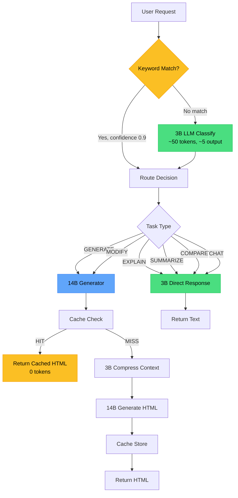
```mermaid
flowchart TD
    A[User Request] --> B{Keyword Match?}
    B -->|Yes, confidence 0.9| D[Route Decision]
    B -->|No match| C[3B LLM Classify<br/>~50 tokens, ~5 output]
    C --> D

    D --> E{Task Type}
    E -->|GENERATE| F[14B Generator]
    E -->|MODIFY| F
    E -->|EXPLAIN| G[3B Direct Response]
    E -->|SUMMARIZE| G
    E -->|COMPARE| G
    E -->|CHAT| G

    F --> H[Cache Check]
    G --> I[Return Text]

    H -->|HIT| J[Return Cached HTML<br/>0 tokens]
    H -->|MISS| K[3B Compress Context]
    K --> L[14B Generate HTML]
    L --> M[Cache Store]
    M --> N[Return HTML]

    style B fill:#fbbf24,stroke:#f59e0b,color:#000
    style C fill:#4ade80,stroke:#22c55e,color:#000
    style F fill:#60a5fa,stroke:#3b82f6,color:#000
    style G fill:#4ade80,stroke:#22c55e,color:#000
    style J fill:#fbbf24,stroke:#f59e0b,color:#000
```

### Keyword Classification Rules

The router first attempts zero-cost keyword matching before falling back to the 3B LLM:

| Signal Words | Task Type | Model |
|-------------|-----------|-------|
| create, build, generate, playground, html, visualize | GENERATE | 14B |
| fix, update, change + "playground" | MODIFY | 14B |
| what is, how does, explain, why, tell me about | EXPLAIN | 3B |
| summarize, summary, overview, recap | SUMMARIZE | 3B |
| compare, difference, vs, versus | COMPARE | 3B |
| hi, hello, thanks, ok | CHAT | 3B |

**Confidence levels:**
- Keyword match: 0.9
- LLM classification: 0.8
- LLM fallback (unclear): 0.5
- Default fallback: 0.3 (defaults to GENERATE)

### Context Compression

For requests with workflow context, the 3B model compresses the data before it reaches the 14B:

```
Before compression: ~1500 tokens (full workflow JSON)
After compression:  ~300 tokens (10-line bullet summary)
Savings: ~80% on 14B input tokens
```

---

## Generation Pipeline

### Complete Generation Sequence

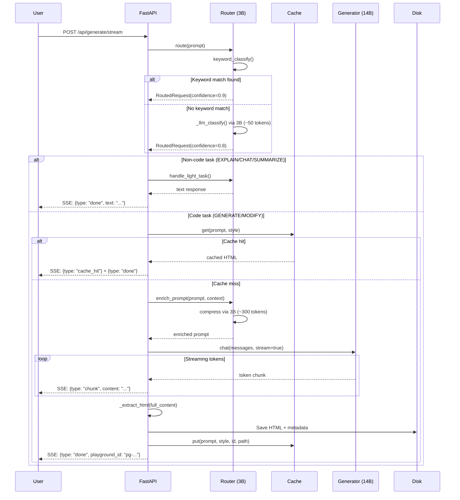
```mermaid
sequenceDiagram
    participant U as User
    participant F as FastAPI
    participant R as Router (3B)
    participant C as Cache
    participant G as Generator (14B)
    participant D as Disk

    U->>F: POST /api/generate/stream
    F->>R: route(prompt)
    R->>R: keyword_classify()

    alt Keyword match found
        R-->>F: RoutedRequest(confidence=0.9)
    else No keyword match
        R->>R: _llm_classify() via 3B (~50 tokens)
        R-->>F: RoutedRequest(confidence=0.8)
    end

    alt Non-code task (EXPLAIN/CHAT/SUMMARIZE)
        F->>R: handle_light_task()
        R-->>F: text response
        F-->>U: SSE: {type: "done", text: "..."}
    else Code task (GENERATE/MODIFY)
        F->>C: get(prompt, style)
        alt Cache hit
            C-->>F: cached HTML
            F-->>U: SSE: {type: "cache_hit"} + {type: "done"}
        else Cache miss
            F->>R: enrich_prompt(prompt, context)
            R->>R: compress via 3B (~300 tokens)
            R-->>F: enriched prompt

            F->>G: chat(messages, stream=true)
            loop Streaming tokens
                G-->>F: token chunk
                F-->>U: SSE: {type: "chunk", content: "..."}
            end

            F->>F: _extract_html(full_content)
            F->>D: Save HTML + metadata
            F->>C: put(prompt, style, id, path)
            F-->>U: SSE: {type: "done", playground_id: "pg-..."}
        end
    end
```

### System Prompt Design

The generator system prompt is intentionally compact (~150 tokens vs ~600 in v1):

```
Generate a self-contained HTML page. Rules:
1. Output ONLY <!DOCTYPE html>...</html>, no markdown/explanation
2. Inline all CSS/JS. Only CDN allowed: Tailwind (cdn.tailwindcss.com)
3. Use #008A4C as accent color, clean modern design
4. Make it interactive: clickable steps, accordions, form demos, hover effects
5. Include step indicators for workflows, progress bars, tabbed interfaces
6. Responsive design. Title bar with page name.
```

### HTML Extraction

The generator handles multiple output formats from the LLM:

1. Clean HTML (starts with `<!DOCTYPE` or `<html>`) — used as-is
2. Wrapped in ` ```html ` fences — extracted via regex
3. Wrapped in generic ` ``` ` fences — extracted via regex
4. Mixed content — regex search for `<!DOCTYPE html>...</html>`

---

## RAG Pipeline

### Architecture

The RAG (Retrieval-Augmented Generation) pipeline injects relevant workflow context into the 14B generator without inflating the system prompt. It uses ChromaDB for vector storage and Ollama's `nomic-embed-text` for embeddings — running entirely on CPU with zero VRAM impact.

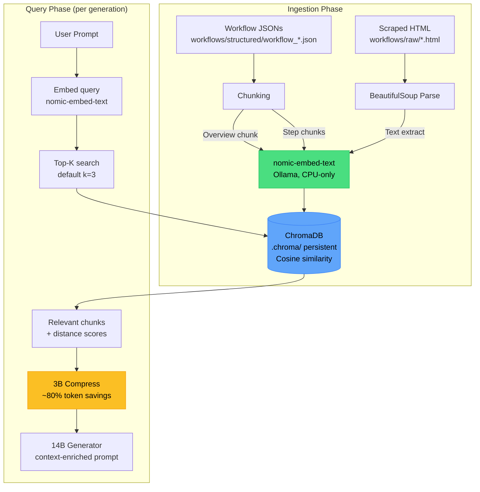
```mermaid
flowchart TD
    subgraph Ingestion["Ingestion Phase"]
        WF[Workflow JSONs<br/>workflows/structured/workflow_*.json] --> CHUNK[Chunking]
        RAW[Scraped HTML<br/>workflows/raw/*.html] --> PARSE[BeautifulSoup Parse]

        CHUNK --> |Overview chunk| EMB[nomic-embed-text<br/>Ollama, CPU-only]
        CHUNK --> |Step chunks| EMB
        PARSE --> |Text extract| EMB

        EMB --> CHROMA[(ChromaDB<br/>.chroma/ persistent<br/>Cosine similarity)]
    end

    subgraph Query["Query Phase (per generation)"]
        PROMPT[User Prompt] --> QEMB[Embed query<br/>nomic-embed-text]
        QEMB --> SEARCH[Top-K search<br/>default k=3]
        SEARCH --> CHROMA
        CHROMA --> RESULTS[Relevant chunks<br/>+ distance scores]
        RESULTS --> COMPRESS[3B Compress<br/>~80% token savings]
        COMPRESS --> GEN[14B Generator<br/>context-enriched prompt]
    end

    style EMB fill:#4ade80,stroke:#22c55e,color:#000
    style CHROMA fill:#60a5fa,stroke:#3b82f6,color:#000
    style COMPRESS fill:#fbbf24,stroke:#f59e0b,color:#000
```

### Chunking Strategy

| Source | Chunk Type | Content | Max Size |
|--------|-----------|---------|----------|
| Workflow JSON | `overview` | Name, category, description, prerequisites, tags | ~500 chars |
| Workflow JSON | `step` | Step number, page title, URL, action, outcome, form fields | 2000 chars |
| Raw HTML | `scraped_page` | Page title + extracted text (nav/footer/script removed) | 2000 chars |

### Embedding Configuration

| Property | Value |
|----------|-------|
| Model | `nomic-embed-text` (137M params) |
| Compute | CPU only (zero VRAM impact on RTX 4090) |
| Vector DB | ChromaDB `PersistentClient` |
| Similarity Metric | Cosine distance (`hnsw:space: cosine`) |
| Collection Name | `td_workflows` |
| Default Top-K | 3 |
| Storage | `.chroma/` directory (persistent across restarts) |

### API Endpoints

| Endpoint | Action |
|----------|--------|
| `POST /api/rag/ingest` | Embed all workflows + scraped pages |
| `POST /api/rag/query` | Test retrieval with a query string |
| `POST /api/rag/clear` | Delete collection and reset |
| `GET /api/rag/stats` | Collection size, model info, chunk count |

---

## Metrics & Observability

### SQLite Metrics Store

All generation metrics are persisted in SQLite (`MetricsCollector` in `playground/metrics.py`), enabling the ML Metrics dashboard tab.

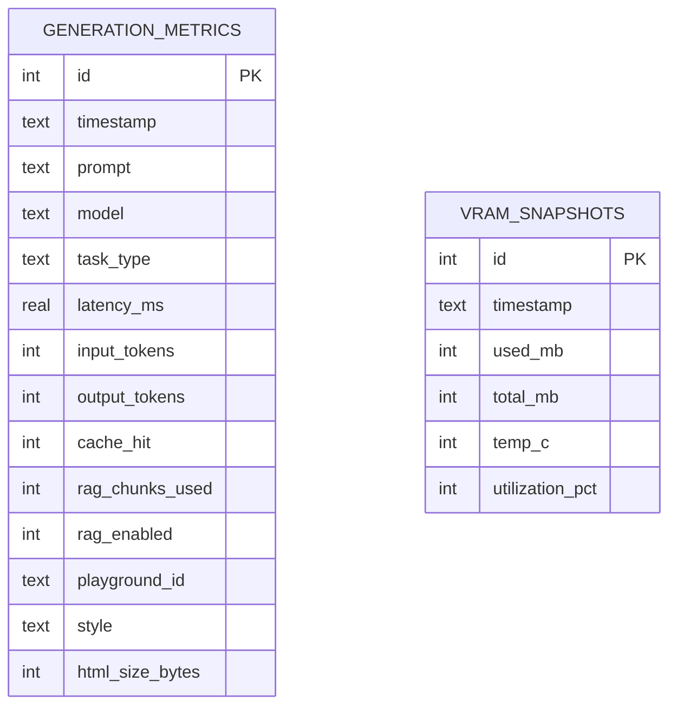
```mermaid
erDiagram
    GENERATION_METRICS {
        int id PK
        text timestamp
        text prompt
        text model
        text task_type
        real latency_ms
        int input_tokens
        int output_tokens
        int cache_hit
        int rag_chunks_used
        int rag_enabled
        text playground_id
        text style
        int html_size_bytes
    }

    VRAM_SNAPSHOTS {
        int id PK
        text timestamp
        int used_mb
        int total_mb
        int temp_c
        int utilization_pct
    }
```

### Tracked Metrics

| Metric | Source | Dashboard Location |
|--------|--------|-------------------|
| Total generations | `COUNT(*)` from generation_metrics | ML Metrics tab |
| Cache hit rate | `COUNT(cache_hit=1) / total` | ML Metrics tab + Generate stats |
| Avg latency (non-cache) | `AVG(latency_ms) WHERE cache_hit=0` | ML Metrics tab |
| Token usage | `SUM(input_tokens + output_tokens)` | ML Metrics tab |
| Model breakdown | `GROUP BY model` — count + avg latency | ML Metrics tab |
| RAG usage | `COUNT(rag_chunks_used > 0)` | ML Metrics tab |
| Last 24h activity | `WHERE timestamp > NOW-24h` | ML Metrics tab |
| VRAM snapshots | nvidia-smi subprocess | Navbar VRAM bar |
| Recent 50 generations | `ORDER BY id DESC LIMIT 50` | ML Metrics activity log |

---

## Caching Layer

### Cache Architecture

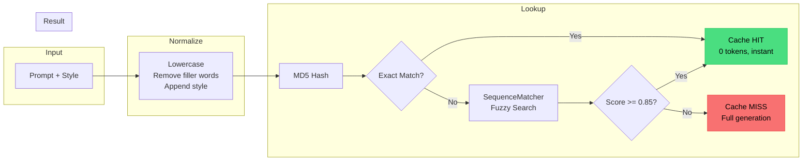
```mermaid
flowchart LR
    subgraph Input
        P[Prompt + Style]
    end

    subgraph Normalize
        N[Lowercase<br/>Remove filler words<br/>Append style]
    end

    subgraph Lookup
        H[MD5 Hash] --> E{Exact Match?}
        E -->|Yes| HIT
        E -->|No| F[SequenceMatcher<br/>Fuzzy Search]
        F --> T{Score >= 0.85?}
        T -->|Yes| HIT
        T -->|No| MISS
    end

    subgraph Result
        HIT[Cache HIT<br/>0 tokens, instant]
        MISS[Cache MISS<br/>Full generation]
    end

    P --> N --> H

    style HIT fill:#4ade80,stroke:#22c55e,color:#000
    style MISS fill:#f87171,stroke:#ef4444,color:#000
```

### Normalization

Before comparison, prompts are normalized:
1. Lowercased
2. Filler words removed: "please", "can you", "i want", "create", "generate", "a", "the"
3. Style appended: `{normalized_prompt}|{style}`

Example: `"Please create a mortgage calculator"` becomes `"mortgage calculator|banking"`

### Eviction Strategy

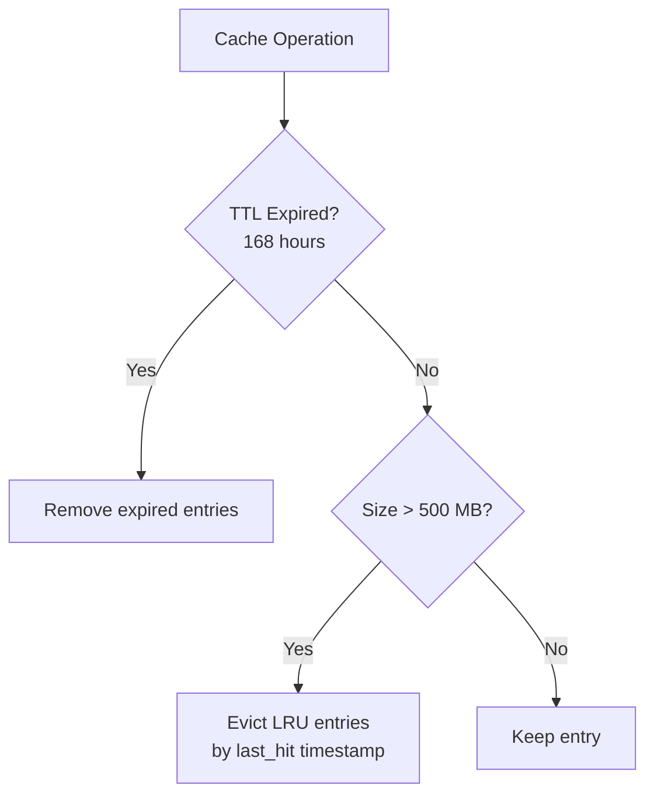
```mermaid
flowchart TD
    A[Cache Operation] --> B{TTL Expired?<br/>168 hours}
    B -->|Yes| C[Remove expired entries]
    B -->|No| D{Size > 500 MB?}
    D -->|Yes| E[Evict LRU entries<br/>by last_hit timestamp]
    D -->|No| F[Keep entry]
```

### Cache Statistics

Tracked metrics:
- `entries`: Number of cached playgrounds
- `hits` / `misses`: Request outcomes
- `hit_rate`: Percentage (typical: 15-30% after 50+ generations)
- `total_saved_tokens`: Cumulative tokens not spent
- `est_saved_cost_usd`: At $0.015/1K tokens equivalent

---

## Scraping & Data Pipeline

### Capture Flow

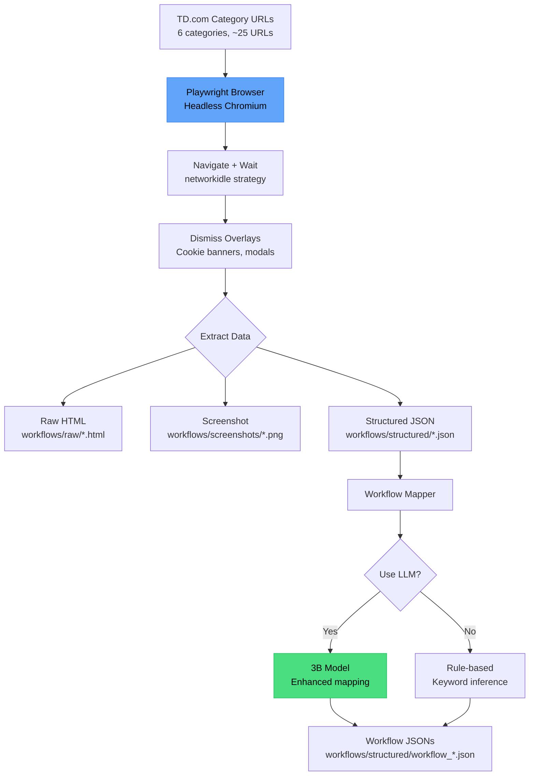
```mermaid
flowchart TD
    A[TD.com Category URLs<br/>6 categories, ~25 URLs] --> B[Playwright Browser<br/>Headless Chromium]
    B --> C[Navigate + Wait<br/>networkidle strategy]
    C --> D[Dismiss Overlays<br/>Cookie banners, modals]
    D --> E{Extract Data}

    E --> F[Raw HTML<br/>workflows/raw/*.html]
    E --> G[Screenshot<br/>workflows/screenshots/*.png]
    E --> H[Structured JSON<br/>workflows/structured/*.json]

    H --> I[Workflow Mapper]

    I --> J{Use LLM?}
    J -->|Yes| K[3B Model<br/>Enhanced mapping]
    J -->|No| L[Rule-based<br/>Keyword inference]

    K --> M[Workflow JSONs<br/>workflows/structured/workflow_*.json]
    L --> M

    style B fill:#60a5fa,stroke:#3b82f6,color:#000
    style K fill:#4ade80,stroke:#22c55e,color:#000
```

### Extracted Data Structure

Each page capture produces:

```json
{
    "url": "https://www.td.com/ca/en/personal-banking/banking/mortgages",
    "title": "Mortgages | TD Canada Trust",
    "category": "mortgages",
    "meta_description": "...",
    "breadcrumbs": [{"label": "Home", "url": "..."}, ...],
    "headings": [{"level": 1, "text": "Mortgages"}, ...],
    "links": [{"label": "Apply Now", "url": "...", "is_cta": true}, ...],
    "buttons": [{"label": "Get Started", "type": "button"}, ...],
    "forms": [{"action": "...", "method": "post", "fields": [...]}],
    "sections": [{"id": "section-0", "title": "...", "has_cta": true}, ...],
    "cards": [{"title": "Fixed Rate", "description": "..."}, ...],
    "captured_at": "2026-02-08T..."
}
```

### Workflow Categories

| Category | Pages | URL Base |
|----------|-------|----------|
| Bank Accounts | 4 | `/banking/accounts/*` |
| Credit Cards | 5 | `/banking/credit-cards/*` |
| Mortgages | 4 | `/banking/mortgages/*` |
| Personal Loans | 4 | `/banking/personal-loans/*` |
| Investing | 5 | `/investing/*` |
| Insurance | 4 | `/insurance/*` |

---

## Fine-Tuning Pipeline

### End-to-End Training Flow

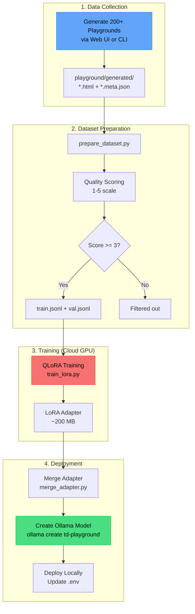
```mermaid
flowchart TD
    subgraph DataCollection["1. Data Collection"]
        A[Generate 200+ Playgrounds<br/>via Web UI or CLI] --> B[playground/generated/<br/>*.html + *.meta.json]
    end

    subgraph Preparation["2. Dataset Preparation"]
        B --> C[prepare_dataset.py]
        C --> D[Quality Scoring<br/>1-5 scale]
        D --> E{Score >= 3?}
        E -->|Yes| F[train.jsonl + val.jsonl]
        E -->|No| G[Filtered out]
    end

    subgraph Training["3. Training (Cloud GPU)"]
        F --> H[QLoRA Training<br/>train_lora.py]
        H --> I[LoRA Adapter<br/>~200 MB]
    end

    subgraph Deployment["4. Deployment"]
        I --> J[Merge Adapter<br/>merge_adapter.py]
        J --> K[Create Ollama Model<br/>ollama create td-playground]
        K --> L[Deploy Locally<br/>Update .env]
    end

    style A fill:#60a5fa,stroke:#3b82f6,color:#000
    style H fill:#f87171,stroke:#ef4444,color:#000
    style K fill:#4ade80,stroke:#22c55e,color:#000
```

### Quality Scoring

Each playground is scored 1-5 based on:

| Criterion | Points | Check |
|-----------|--------|-------|
| Valid HTML structure | +1 | Has `<!DOCTYPE html>` and `</html>` |
| Interactive elements | +1 | Has `onclick`, `addEventListener`, `function`, `.active` (2+ matches) |
| Styling present | +1 | Has Tailwind CDN or `<style>` block |
| Reasonable size | +1 | 2KB-50KB range |
| Base score | +1 | Always |

Only examples with score >= 3 are included in training data.

### QLoRA Configuration

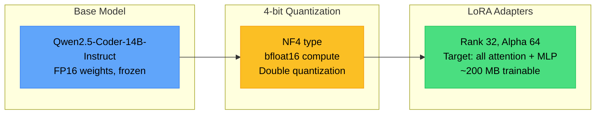
```mermaid
graph LR
    subgraph Base["Base Model"]
        B[Qwen2.5-Coder-14B-Instruct<br/>FP16 weights, frozen]
    end

    subgraph LoRA["LoRA Adapters"]
        L[Rank 32, Alpha 64<br/>Target: all attention + MLP<br/>~200 MB trainable]
    end

    subgraph Quantization["4-bit Quantization"]
        Q[NF4 type<br/>bfloat16 compute<br/>Double quantization]
    end

    B --> Q --> L

    style B fill:#60a5fa,stroke:#3b82f6,color:#000
    style L fill:#4ade80,stroke:#22c55e,color:#000
    style Q fill:#fbbf24,stroke:#f59e0b,color:#000
```

**Training hyperparameters:**

| Parameter | Value | Rationale |
|-----------|-------|-----------|
| LoRA rank | 32 | Balance quality vs VRAM (lower than typical 64) |
| LoRA alpha | 64 | 2x rank for stable training |
| Learning rate | 1e-4 | Conservative for code models |
| Batch size | 2 | Fits in 16 GB |
| Gradient accumulation | 8 | Effective batch = 16 |
| Epochs | 3 | Sufficient for 200-500 examples |
| Scheduler | Cosine | Smooth LR decay |
| Warmup | 3% of steps | Prevent early instability |
| Optimizer | paged_adamw_32bit | Memory-efficient |

**Target modules:** `q_proj`, `k_proj`, `v_proj`, `o_proj`, `gate_proj`, `up_proj`, `down_proj`

---

## Web Application Architecture

### Dashboard Rendering

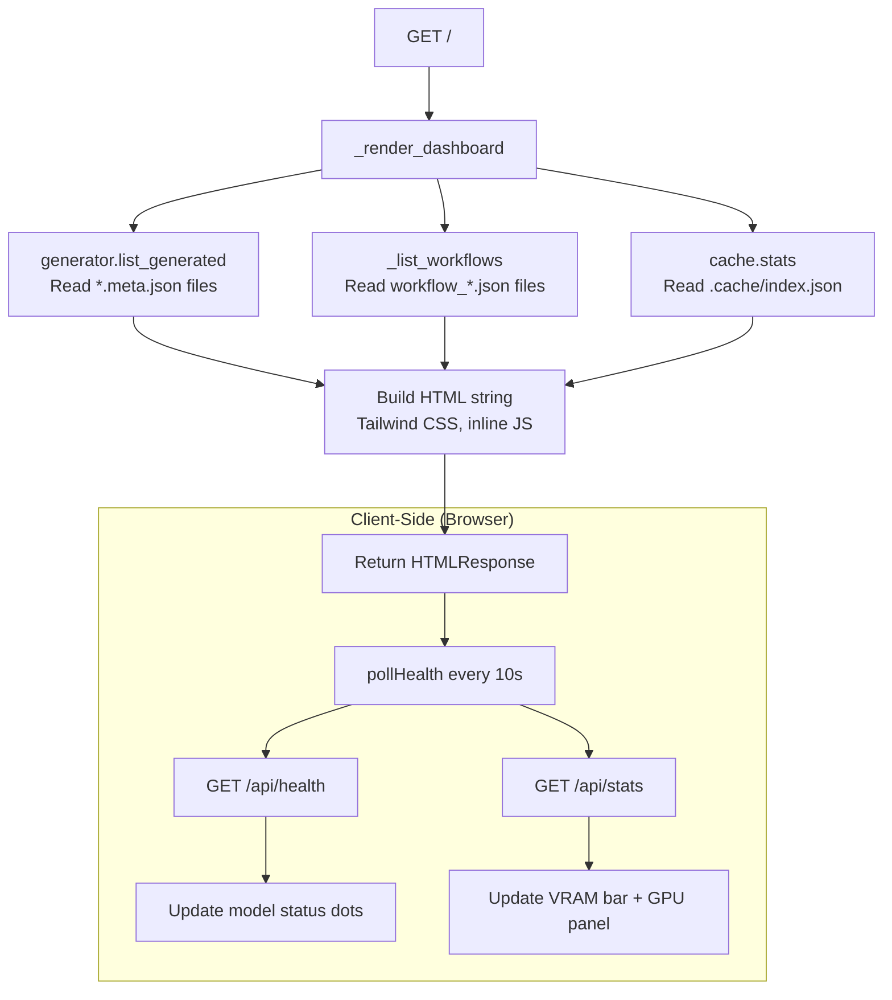
```mermaid
flowchart TD
    A[GET /] --> B[_render_dashboard]
    B --> C[generator.list_generated<br/>Read *.meta.json files]
    B --> D[_list_workflows<br/>Read workflow_*.json files]
    B --> E[cache.stats<br/>Read .cache/index.json]
    C --> F[Build HTML string<br/>Tailwind CSS, inline JS]
    D --> F
    E --> F
    F --> G[Return HTMLResponse]

    subgraph ClientSide["Client-Side (Browser)"]
        G --> H[pollHealth every 10s]
        H --> I[GET /api/health]
        H --> J[GET /api/stats]
        I --> K[Update model status dots]
        J --> L[Update VRAM bar + GPU panel]
    end
```

### SSE Streaming Architecture

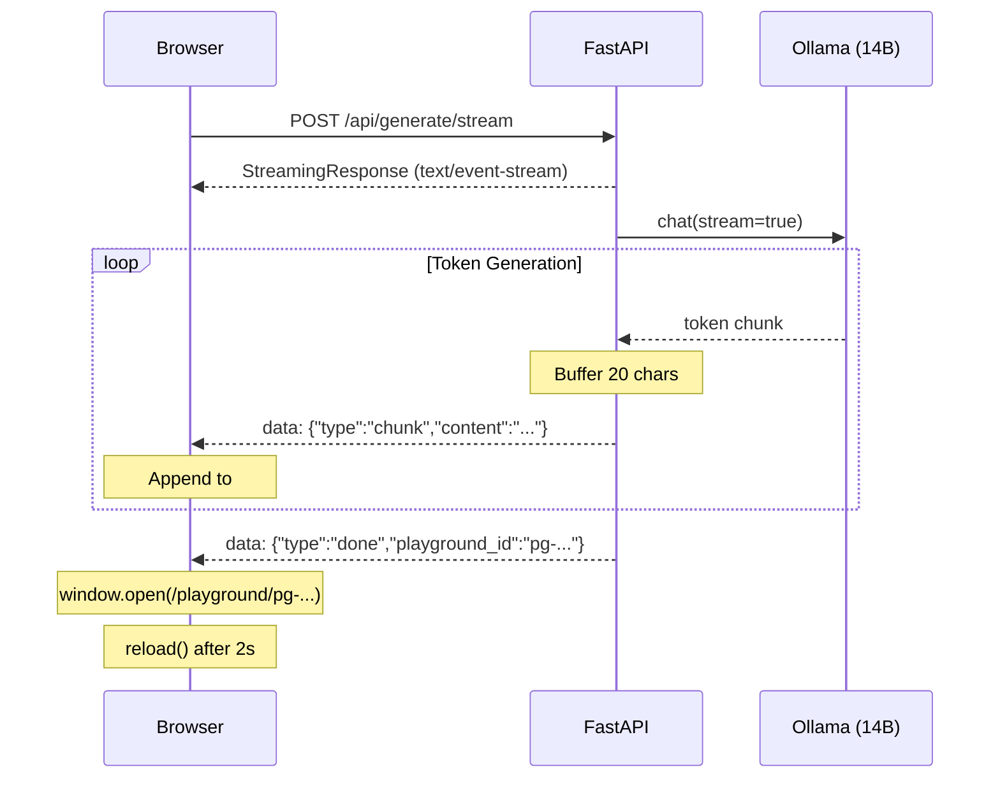
```mermaid
sequenceDiagram
    participant B as Browser
    participant F as FastAPI
    participant O as Ollama (14B)

    B->>F: POST /api/generate/stream
    F-->>B: StreamingResponse (text/event-stream)

    F->>O: chat(stream=true)
    loop Token Generation
        O-->>F: token chunk
        Note over F: Buffer 20 chars
        F-->>B: data: {"type":"chunk","content":"..."}
        Note over B: Append to #stream-output
    end

    F-->>B: data: {"type":"done","playground_id":"pg-..."}
    Note over B: window.open(/playground/pg-...)
    Note over B: reload() after 2s
```

### UI Components

| Component | Location | Data Source |
|-----------|----------|-------------|
| VRAM bar (navbar) | `#vram-fill` | `/api/stats` → `vram.usage_pct` |
| Model dots (navbar) | `#gen-dot`, `#rtr-dot` | `/api/health` → `generator_ready` |
| Stats cards | Top row | Dashboard render + `/api/stats` |
| Generator input | Center panel | User input → POST `/api/generate/stream` |
| Stream output | `#stream-output` | SSE chunks from `/api/generate/stream` |
| Playground table | Left column | `generator.list_generated()` |
| Workflow cards | Right sidebar | `_list_workflows()` |
| GPU panel | Right sidebar | `/api/stats` → `vram.*` |

---

## VRAM Budget Analysis

### Memory Breakdown (RTX 4090, 16384 MB)

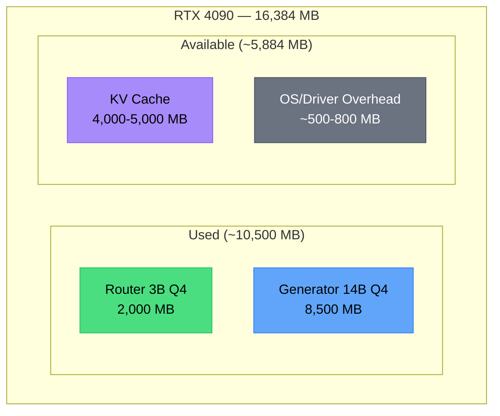
```mermaid
graph TB
    subgraph Total["RTX 4090 — 16,384 MB"]
        subgraph Used["Used (~10,500 MB)"]
            R["Router 3B Q4<br/>2,000 MB"]
            G["Generator 14B Q4<br/>8,500 MB"]
        end
        subgraph Free["Available (~5,884 MB)"]
            KV["KV Cache<br/>4,000-5,000 MB"]
            OS["OS/Driver Overhead<br/>~500-800 MB"]
        end
    end

    style R fill:#4ade80,stroke:#22c55e,color:#000
    style G fill:#60a5fa,stroke:#3b82f6,color:#000
    style KV fill:#a78bfa,stroke:#8b5cf6,color:#000
    style OS fill:#6b7280,stroke:#4b5563,color:#fff
```

### KV Cache Impact

With 5.5 GB available for KV cache at 8192 context:

- **14B model**: ~4.2 GB KV cache at full context → fits
- **3B model**: ~0.8 GB KV cache at full context → fits
- Both can run concurrently (Ollama manages model loading)

### Fallback Options

If VRAM is tight:

| Config | Generator | Router | Total VRAM | Quality |
|--------|-----------|--------|------------|---------|
| **Default** | 14B Q4 | 3B Q4 | ~10.5 GB | Best |
| **Compact** | 7B Q4 | 3B Q4 | ~6.5 GB | Good |
| **Minimal** | 7B Q4 | 1.5B Q4 | ~5 GB | Acceptable |

---

## Token Optimization Strategy

### Before vs After Optimization


```mermaid
graph LR
    subgraph Before["v1 — Single Model"]
        A1[System Prompt<br/>~600 tokens]
        A2[Full Workflow JSON<br/>~2000 tokens]
        A3[User Prompt<br/>~200 tokens]
        A4[Output<br/>~5000 tokens]
        A5[Total: ~7800 tokens<br/>+ all tasks on 32B]
    end

    subgraph After["v2 — Dual Model"]
        B1[System Prompt<br/>~150 tokens]
        B2[Compressed Context<br/>~300 tokens]
        B3[User Prompt<br/>~200 tokens]
        B4[Output<br/>~4000 tokens]
        B5[Total: ~4650 tokens<br/>+ 60% of tasks on 3B]
    end

    Before -.->|~40% reduction| After

    style A5 fill:#f87171,stroke:#ef4444,color:#000
    style B5 fill:#4ade80,stroke:#22c55e,color:#000
```

### Optimization Techniques

| Technique | Token Savings | Implementation |
|-----------|--------------|----------------|
| Compact system prompt | 75% (600 → 150) | Rewritten to minimal instructions |
| 3B context compression | 80% (2000 → 300) | `router.enrich_prompt()` |
| Keyword routing | 100% (no LLM call) | `_keyword_classify()` |
| Semantic caching | 100% per hit | `PlaygroundCache.get()` |
| 3B for non-code | 90% vs 14B | Router sends to small model |
| Style hints | 90% (paragraph → one line) | `_style_hint()` |

### Effective Token Budget Per Request

| Request Type | Model | Input Tokens | Output Tokens | Total |
|-------------|-------|-------------|--------------|-------|
| GENERATE (no context) | 14B | ~350 | ~4000 | ~4350 |
| GENERATE (with context) | 14B | ~650 | ~4000 | ~4650 |
| GENERATE (cache hit) | — | 0 | 0 | **0** |
| EXPLAIN | 3B | ~200 | ~300 | ~500 |
| CHAT | 3B | ~100 | ~150 | ~250 |
| SUMMARIZE | 3B | ~300 | ~200 | ~500 |
| ROUTING (keyword) | — | 0 | 0 | **0** |
| ROUTING (3B fallback) | 3B | ~50 | ~5 | ~55 |

---

## Data Models

### Entity Relationship

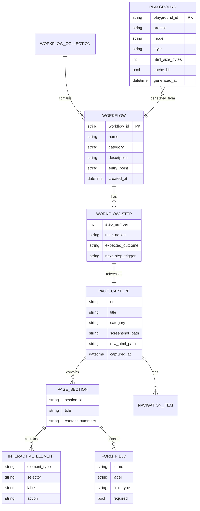
```mermaid
erDiagram
    WORKFLOW_COLLECTION ||--o{ WORKFLOW : contains
    WORKFLOW ||--o{ WORKFLOW_STEP : has
    WORKFLOW_STEP ||--|| PAGE_CAPTURE : references
    PAGE_CAPTURE ||--o{ PAGE_SECTION : contains
    PAGE_CAPTURE ||--o{ NAVIGATION_ITEM : has
    PAGE_SECTION ||--o{ INTERACTIVE_ELEMENT : contains
    PAGE_SECTION ||--o{ FORM_FIELD : contains
    PLAYGROUND }o--|| WORKFLOW : generated_from

    WORKFLOW {
        string workflow_id PK
        string name
        string category
        string description
        string entry_point
        datetime created_at
    }

    WORKFLOW_STEP {
        int step_number
        string user_action
        string expected_outcome
        string next_step_trigger
    }

    PAGE_CAPTURE {
        string url
        string title
        string category
        string screenshot_path
        string raw_html_path
        datetime captured_at
    }

    PAGE_SECTION {
        string section_id
        string title
        string content_summary
    }

    INTERACTIVE_ELEMENT {
        string element_type
        string selector
        string label
        string action
    }

    FORM_FIELD {
        string name
        string label
        string field_type
        bool required
    }

    PLAYGROUND {
        string playground_id PK
        string prompt
        string model
        string style
        int html_size_bytes
        bool cache_hit
        datetime generated_at
    }
```

---

## Deployment Architecture

### Local Development

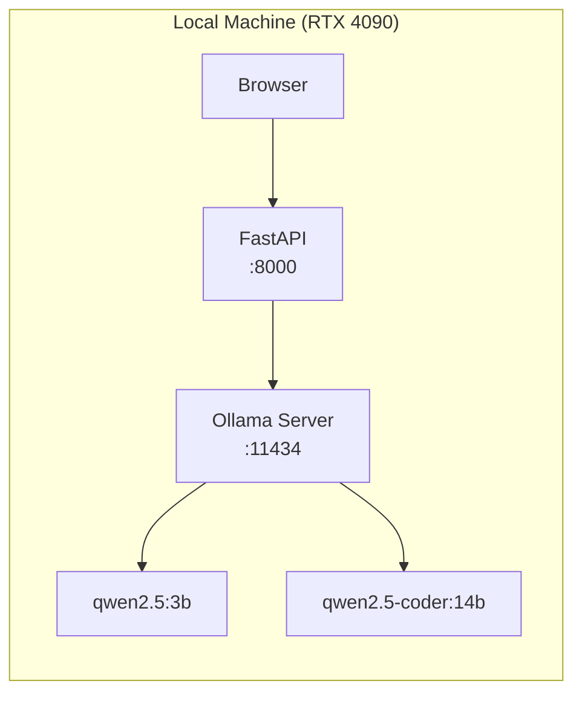
```mermaid
graph LR
    subgraph Local["Local Machine (RTX 4090)"]
        A[Ollama Server<br/>:11434] --> B[qwen2.5:3b]
        A --> C[qwen2.5-coder:14b]
        D[FastAPI<br/>:8000] --> A
        E[Browser] --> D
    end
```

### Docker Deployment

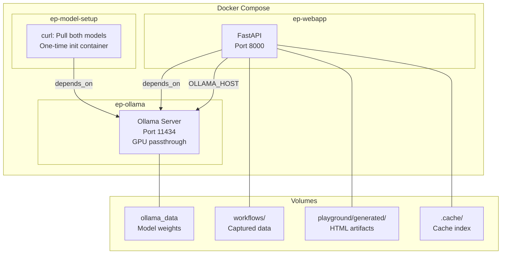
```mermaid
graph TB
    subgraph Docker["Docker Compose"]
        subgraph OllamaContainer["ep-ollama"]
            O[Ollama Server<br/>Port 11434<br/>GPU passthrough]
        end
        subgraph WebApp["ep-webapp"]
            W[FastAPI<br/>Port 8000]
        end
        subgraph Init["ep-model-setup"]
            I[curl: Pull both models<br/>One-time init container]
        end

        I -->|depends_on| O
        W -->|depends_on| O
        W -->|OLLAMA_HOST| O
    end

    subgraph Volumes
        V1[ollama_data<br/>Model weights]
        V2[workflows/<br/>Captured data]
        V3[playground/generated/<br/>HTML artifacts]
        V4[.cache/<br/>Cache index]
    end

    O --- V1
    W --- V2
    W --- V3
    W --- V4
```

### Cloud GPU (Fine-Tuning Only)

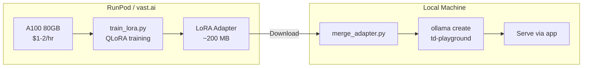
```mermaid
graph LR
    subgraph RunPod["RunPod / vast.ai"]
        GPU[A100 80GB<br/>$1-2/hr]
        GPU --> T[train_lora.py<br/>QLoRA training]
        T --> A[LoRA Adapter<br/>~200 MB]
    end

    subgraph Local["Local Machine"]
        A -->|Download| M[merge_adapter.py]
        M --> O[ollama create<br/>td-playground]
        O --> S[Serve via app]
    end
```

---

## Security Considerations

### Data Privacy

- All data stays on local infrastructure (no cloud API calls during inference)
- Scraped data from public TD.com pages only (no authentication-gated content)
- Generated HTML is self-contained (no external callbacks or tracking)
- Cache stored locally in `.cache/` directory

### Network Exposure

- Default bind: `0.0.0.0:8000` — accessible on LAN
- For production: use a reverse proxy (nginx/caddy) with TLS
- Ollama default: `localhost:11434` — not exposed externally
- No authentication on API endpoints by default (add middleware for production)

### Model Security

- Models downloaded from Ollama registry (verified checksums)
- Fine-tuned models stored locally
- No model weights transmitted to external services

### Input Sanitization

- User prompts are passed directly to LLM (no SQL/code injection risk — LLM is not executing code)
- Generated HTML served via `HTMLResponse` — users opening playgrounds should treat them as untrusted content
- For production: serve generated HTML in sandboxed iframes with `sandbox` attribute
