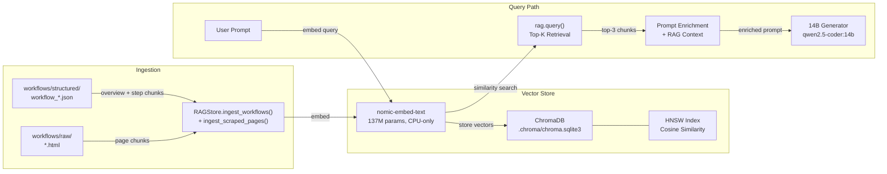

# RAG Architecture

Retrieval-Augmented Generation pipeline for the Enterprise Playground system. Uses ChromaDB with Ollama embeddings to enrich LLM prompts with relevant TD Banking workflow context.

## Pipeline Flow



## Core Implementation

| File | Lines | Purpose |
|------|-------|---------|
| `playground/rag.py` | 1-417 | RAGStore class — ingestion, querying, analytics |
| `playground/generator.py` | 111-126 | RAG query + prompt enrichment during generation |
| `playground/generator.py` | 221-232 | RAG in streaming generation path |
| `webapp/app.py` | 210-241 | REST API endpoints for RAG operations |
| `webapp/app.py` | 346-363 | Observatory chunk analytics endpoints |
| `config.py` | 59-63 | RAG configuration (model, top_k, collection) |
| `playground/metrics.py` | 40-42 | RAG usage tracking in SQLite |

## Configuration

```python
# config.py (lines 59-63)
RAG_ENABLED = os.getenv("RAG_ENABLED", "true")
RAG_EMBED_MODEL = os.getenv("RAG_EMBED_MODEL", "nomic-embed-text")
RAG_COLLECTION = os.getenv("RAG_COLLECTION", "td_workflows")
RAG_TOP_K = int(os.getenv("RAG_TOP_K", "3"))
```

**Paths:**
- Vector store: `.chroma/` (ChromaDB persistent directory)
- SQLite DB: `.chroma/chroma.sqlite3`
- HNSW index: `.chroma/<collection-uuid>/`

## RAGStore Class

### Key Methods

| Method | Lines | Description |
|--------|-------|-------------|
| `__init__()` | 27-30 | Lazy-loads ChromaDB client, collection, embedding function |
| `_get_client()` | 36-40 | Returns persistent ChromaDB client at `.chroma/` |
| `_get_embed_fn()` | 42-59 | Wraps Ollama `nomic-embed-text` for embedding |
| `_get_collection()` | 61-79 | Creates/retrieves `td_workflows` collection (HNSW, cosine) |
| `ingest_workflows()` | 81-162 | Chunks structured workflow JSONs into overview + step documents |
| `ingest_scraped_pages()` | 164-206 | Embeds raw scraped HTML pages |
| `query()` | 208-233 | Vector similarity search, returns top-k chunks |
| `stats()` | 235-252 | Collection metadata (total chunks, model, directory) |
| `get_all_chunks()` | 254-288 | Paginated chunk listing |
| `get_chunk_analytics()` | 290-358 | Size histogram, per-workflow breakdown |
| `find_similar_chunks()` | 360-403 | Find near-duplicate chunks by re-querying |
| `clear()` | 405-416 | Wipe collection and rebuild |

### Ingestion Strategy

Two chunk types are created per workflow:

**Overview Chunk** (1 per workflow):
- Workflow name, category, description
- Prerequisites and tags
- Metadata: `chunk_type=overview`

**Step Chunks** (1 per step):
- Step number, page title, URL
- User action and expected outcome
- Section summaries (first 3 sections, 200 chars each)
- Form field labels
- Metadata: `chunk_type=step`, `step_number=N`

**Scraped Page Chunks:**
- Raw HTML content from `workflows/raw/`
- Metadata: `chunk_type=scraped_page`, `source=scraper`

### Document Metadata Schema

```python
{
    "workflow_id": str,        # e.g., "wf-accounts_chequing-20260208"
    "chunk_type": str,         # "overview" | "step" | "scraped_page"
    "step_number": int,        # step index (step chunks only)
    "category": str,           # e.g., "accounts", "credit_cards"
    "source": str,             # "workflow" | "scraper"
}
```

## Generator Integration

### Standard Generation (`generator.py:111-126`)

```python
# Step 3: RAG context retrieval
rag_chunks = self.rag.query(prompt) if self.rag.enabled else []
rag_context = ""
if rag_chunks:
    rag_context = "\n\nRelevant context from TD workflows:\n"
    for chunk in rag_chunks:
        rag_context += f"---\n{chunk['content']}\n"
```

### Streaming Generation (`generator.py:221-232`)

Same RAG query path. Yields RAG metadata to the client:
```json
{"type": "rag", "chunks": 3, "preview": ["chunk1...", "chunk2...", "chunk3..."]}
```

### Metadata Recording (`generator.py:156-187`)

Each generation records:
- `rag_chunks_used` — number of chunks retrieved
- `rag_enabled` — whether RAG was active
- Stored in SQLite metrics table

## API Endpoints

### RAG Operations (`webapp/app.py`)

| Endpoint | Method | Lines | Description |
|----------|--------|-------|-------------|
| `/api/rag/stats` | GET | 210-212 | Collection stats (total chunks, model, enabled) |
| `/api/rag/ingest` | POST | 215-220 | Trigger full ingestion (workflows + scraped pages) |
| `/api/rag/query` | POST | 233-236 | Query with custom `top_k` parameter |
| `/api/rag/clear` | POST | 239-241 | Wipe collection and rebuild |

### Observatory Endpoints

| Endpoint | Method | Lines | Description |
|----------|--------|-------|-------------|
| `/api/observatory/chunks` | GET | 346-348 | Paginated chunk browser (offset, limit) |
| `/api/observatory/chunk-analytics` | GET | 351-353 | Size histogram, workflow breakdown, source counts |
| `/api/observatory/similar-chunks` | POST | 361-363 | Find duplicate/similar chunks by chunk ID |

## Metrics Tracking

**SQLite Table** (`playground/metrics.py:30-46`):

```sql
CREATE TABLE generation_metrics (
    ...
    rag_chunks_used INTEGER DEFAULT 0,
    rag_enabled INTEGER DEFAULT 0,
    ...
);
```

**Aggregated Stats** (`metrics.py:156-162`):
- `rag_generations` — count of generations where RAG was used
- `avg_rag_chunks` — average chunks retrieved per RAG-enabled query

## Current State

| Metric | Value |
|--------|-------|
| Total chunks | 303 |
| Avg chunk size | 866 chars |
| Min / Max size | 56 / 2000 chars |
| Sources | 2 (workflow + scraper) |
| Disk usage | ~7 MB |
| Embedding model | nomic-embed-text (CPU) |
| VRAM impact | 0 GB |

## CLI Usage

```bash
# Re-ingest all workflows into vector store
curl -X POST http://localhost:8002/api/rag/ingest

# Query RAG directly
curl -X POST http://localhost:8002/api/rag/query \
  -H "Content-Type: application/json" \
  -d '{"query": "credit card comparison", "top_k": 5}'

# Get collection stats
curl http://localhost:8002/api/rag/stats

# Clear and rebuild
curl -X POST http://localhost:8002/api/rag/clear
```

## VRAM Budget

The RAG pipeline is designed for zero VRAM impact:

| Component | Memory | Location |
|-----------|--------|----------|
| nomic-embed-text | ~500MB | System RAM (CPU-only via Ollama) |
| ChromaDB + HNSW index | ~7MB | Disk (SQLite + binary index) |
| Query embeddings | Negligible | CPU |
| **Total VRAM** | **0 GB** | Leaves full 16GB for generator + router |
