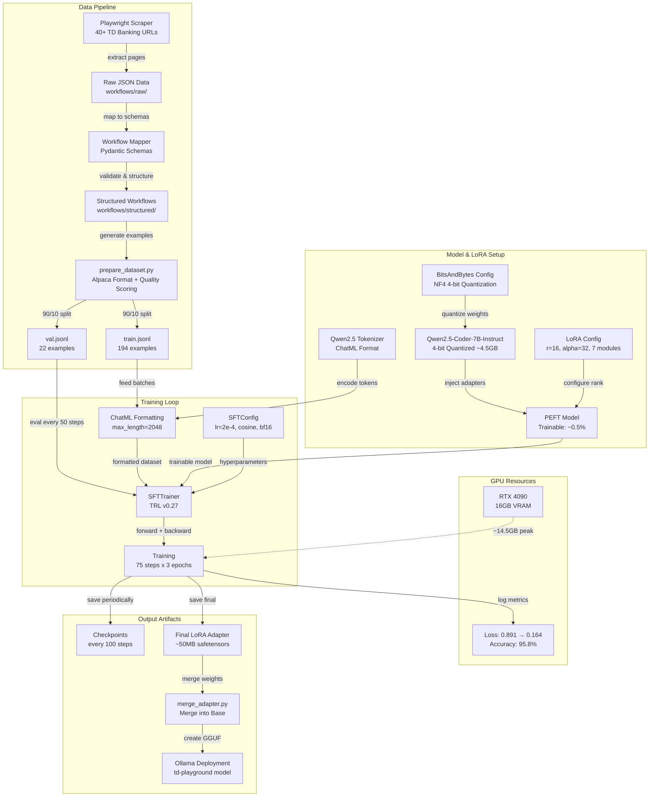

# QLoRA Fine-Tuning Pipeline

End-to-end documentation of the QLoRA fine-tuning pipeline for the Enterprise Playground system.

## Pipeline Overview



## Stage Details

### 1. Data Collection (Scraper)
- **Tool**: Playwright-based headless browser
- **Source**: 40+ TD Banking URLs across 8 categories
- **Output**: Raw JSON files in `workflows/raw/`
- **Categories**: Accounts, Credit Cards, Mortgages, Loans, Investing, Insurance, Tools, Segments

### 2. Workflow Mapping
- **Tool**: `workflow_mapper.py` with Pydantic models
- **Input**: Raw scraped JSON
- **Output**: Structured workflow definitions in `workflows/structured/`
- **Schema**: WorkflowStep, FormField, NavigationFlow, ComponentHierarchy

### 3. Dataset Preparation
- **Tool**: `fine_tuning/prepare_dataset.py`
- **Format**: Alpaca-style (system, instruction, input, output)
- **Split**: 90% train (194 examples), 10% validation (22 examples)
- **Quality**: Scored 1-5 based on output completeness and HTML validity

### 4. Model Setup
| Parameter | Value |
|-----------|-------|
| Base Model | Qwen/Qwen2.5-Coder-7B-Instruct |
| Quantization | 4-bit NF4 (BitsAndBytes) |
| Compute dtype | bfloat16 |
| Double quantization | Enabled |
| VRAM footprint | ~4.5GB |

### 5. LoRA Configuration
| Parameter | Value |
|-----------|-------|
| Rank (r) | 16 |
| Alpha | 32 |
| Scaling factor | 2x (alpha/rank) |
| Target modules | q_proj, k_proj, v_proj, o_proj, gate_proj, up_proj, down_proj |
| Dropout | 0.05 |
| Trainable params | ~0.5% of total |

### 6. Training Configuration
| Parameter | Value |
|-----------|-------|
| Trainer | TRL SFTTrainer v0.27 |
| Batch size | 1 (per device) |
| Gradient accumulation | 4 (effective batch = 4) |
| Learning rate | 2e-4 |
| LR scheduler | Cosine with 3% warmup |
| Optimizer | paged_adamw_32bit |
| Max length | 2048 tokens |
| Precision | bf16 |
| Gradient checkpointing | Enabled |
| Max grad norm | 0.3 |

### 7. Training Results
| Metric | Start | End |
|--------|-------|-----|
| Train Loss | 0.891 | 0.164 |
| Token Accuracy | 79.1% | 95.8% |
| Eval Loss | — | 0.223 |
| Eval Accuracy | — | 93.7% |
| Total Steps | — | 75 |
| Epochs | — | 3 |

### 8. GPU Usage (RTX 4090 16GB)
| Component | VRAM |
|-----------|------|
| Quantized model | ~4.5GB |
| LoRA adapters | ~200MB |
| Optimizer states | ~1.5GB (paged) |
| Activations + KV cache | ~8GB |
| **Peak total** | **~14.5GB** |

### 9. Output Artifacts
- **Checkpoints**: `adapters/td-playground-lora/checkpoint-*/`
- **Final adapter**: `adapters/td-playground-lora/final_adapter/`
  - `adapter_model.safetensors` (~50MB)
  - `adapter_config.json`
  - Tokenizer files

### 10. Deployment Path
```bash
# Merge adapter into base model
python -m fine_tuning.merge_adapter --adapter adapters/td-playground-lora/final_adapter --create-ollama

# Deploy to Ollama
ollama create td-playground -f Modelfile
```
